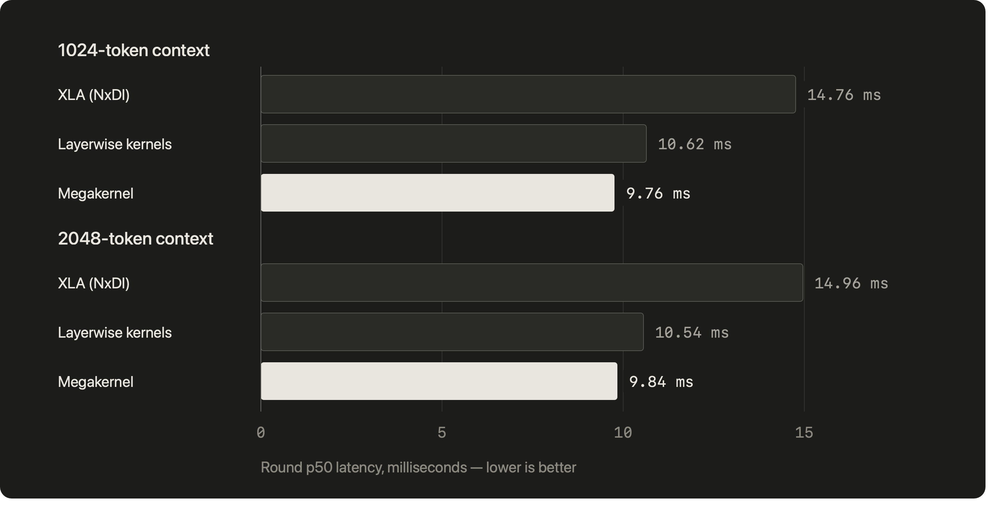
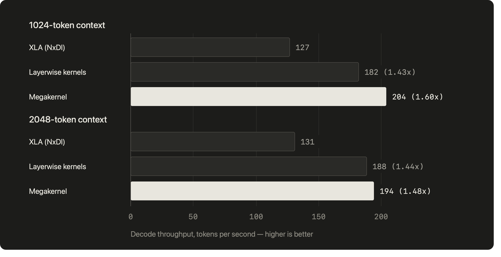

+++
date = '2026-08-18T10:23:09-07:00'
title = 'Fused Speculation Megakernel for Qwen3.6-35B-A3B on Trainium 2'
categories = ["technical"]
+++

In inference systems, there’s a tradeoff between total throughput (tokens/s) and interactivity (tokens/s/user). Batching more users increases utilization of the hardware but slows down the time per output token of any given user. As such, delivering faster tokens to the end user necessarily means that an inference provider is letting capacity be stranded, forcing those tokens to be priced higher. We see the economics play out in Fast Mode for Claude Opus 5, where the same model is priced more than five times higher per output token.

Low-latency inference is vital to user experience in select domains. Fast tokens allow long reasoning traces in agentic coding to complete quicker, helping developers ship code faster. They also make voice models respond faster, making conversation with digital assistants feel more natural.

The phase of inference that generates tokens, known as decode, is bottlenecked by everything other than compute. The latency of loading weights and KV cache into compute units, collectives, kernel setup and teardown time, and materialization of intermediates in memory begin to dominate time-per-output-token (TPOT). This is especially problematic for small batch sizes required for high interactivity decode where kernels are too small to amortize launch and teardown overheads.

NVIDIA licensing Groq’s IP signals their strategic focus on high interactivity use cases. Moreover, [TileRT](https://github.com/tile-ai/tilert) has demonstrated the ability to raise the attainable roofline performance of NVIDIA GPUs by statically compiling the entire decode graph into a single persistent kernel, allowing them to operate independent of the host CPU for the entire decode lifecycle. As [Semianalysis](https://newsletter.semianalysis.com/p/ultra-high-interactivity-on-nvidia) reported, this has already been deployed in production systems by Xiaomi and Z.ai to serve open-source models fast.

[AMD](https://arxiv.org/pdf/2604.15379) also recently published work enabling low latency decode through a persistent kernel programming model that mitigates NUMA effects from chiplet-unaware scheduling and dispatch of kernels. They built a topology-aware scheduler that dispatches tasks to workers throughout an inference decode pass without incurring host CPU roundtrips.

Both major GPU vendors demonstrated that clearing the boundary between kernels makes it possible to meaningfully approach the performance made available by the hardware. Inference ASICs approach this problem by moving the kernel dispatch work to the compiler, creating a static schedule of operations known ahead-of-time that are executed on the hardware. On Trainium, the model is already ahead-of-time compiled into one graph, so there is no host dispatch loop to eliminate. The persistent-kernel argument that motivates TileRT and AMD's work doesn't transfer directly. What fusion actually delivers here is eliminating HBM round-trips for intermediates, and what it adds is a larger scheduling window for the compiler. Most of the performance gains on Trainium come from writing good kernels; fusing across kernel boundaries delivers the final 10% needed when interactivity is central to serving.

This post is a follow-up to my previous work on megakernels for Trainium, introducing a few new innovations that demonstrate the feasibility of running fast inference for modern transformer architectures on Trainium2. I will introduce:

1. A port of [**Qwen3.6-35B-A3B**](https://huggingface.co/Qwen/Qwen3.6-35B-A3B), a hybrid GQA/Gated DeltaNet Architecture with MTP head speculative decoding.
2. Custom Gated DeltaNet Attention kernels in NKI that maintain correctness with speculation.
3. A megakernel that performs the MTP head speculation and target model verification pass in one kernel invocation, keeping residuals on chip, and achieving up to 204 tok/s in single batch decode. 

# Qwen 3.6 and MTP Head Architecture

Qwen3.6-35B-A3B is a MoE model with a hybrid attention architecture with 40 layers, ten of which use Grouped Query Attention (GQA), and the rest use Gated DeltaNet Attention (GDA). Hybrid architectures are increasingly adopted to minimize KV cache pressure and enable efficient long context inference. While softmax attention grows its KV cache linearly with sequence length, linear attention keeps the memory footprint of its recurrent state constant.

The model also ships with a multi-token prediction (MTP) head that generates an additional token given the hidden state and output token from the main model. It can be deployed in the manner of EAGLE3 speculative decoding. The MTP head predicts a token and the main model verifies it given the token prior to it, generating two tokens every decode pass should the prediction be accepted. 



The dataflow is as follows:

1. **Prefill:** Over a prompt of length $i$, the main model generates token $t_{i+1}$ and hidden state $h_i$. The MTP head generates its KV cache up to position $i$ from the prompt.
2. **Decode**
    1. Given $t_{i+1}$ and $h_i$, the MTP head generates a draft token $\hat{t}_{i+2}$
    2. The main model performs a short prefill over the previous token $t_{i+1}$ and draft token $\hat{t}_{i+2}$. It generates the true next token $t_{i+2}$, its hidden state $h_{i+1}$, and an additional token/hidden state pair $\hat{t}_{i+3}$, $\hat{h}_{i+2}$. 
    3. If $\hat{t}_{i+2}==t_{i+2}$, then we keep $\hat{t}_{i+3}$ and thus produce 2 tokens this round. Otherwise, we just keep $t_{i+2}$.
    4. The KV cache at position $i+1$ of the MTP Head is updated. If the draft token is accepted, the newly written position is correct, otherwise it’s overwritten in the next round. We update the KV cache unconditionally since Trainium’s AoT compilation doesn’t support branching.

This model is not officially supported by AWS, so the precursor to any of this work was completing a functional port using NeuronX Distributed Inference (NxDI), the default library for instantiating models on Trainium for inference. NxDI compiles a PyTorch model, first lowering it to XLA ops, then passing it to the Neuron backend compiler to generate machine code. This work predates the release of the vLLM-Neuron plugin which is the new entry point to inference on the hardware.

# Megakernel

The inputs and outputs of every kernel in Trainium, written in their Python DSL called NKI, must be resident in HBM. Using smaller kernels with few operations spills intermediates frequently and increases the number of HBM roundtrips, thus being the primary motivation for maximally fusing operations. Frequent roundtrips to HBM are also problematic for high interactivity inference where batch sizes are too small to amortize memory access latency.

Each NKI kernel is decorated with nki.jit, and compiled by the NKI compiler independently and subsequently inserted into the model graph. The entire model is thus ahead-of-time compiled into a single graph, unlike in GPU programming models where a runtime dispatches kernels to the device. However, since the NKI compiler optimizes each kernel call independently, exposing more operations to it can potentially enable better op reordering, scheduling, and compute/communication overlap.

My previous work already laid the groundwork for writing megakernels for MoE models with GQA layers. A megakernel can be composed using a set of coarse operations that are individually optimized and which expose sbuf-resident outputs that can be consumed by downstream steps. Authoring and optimizing a megakernel introduces a few key challenges:

1. Each subkernel must be tested in isolation for numerical parity against a PyTorch reference. They must also expose a HBM resident path to be compatible with a PyTorch test harness.
2. The layout of activations must remain consistent throughout the kernel. Any discrepancies in how activations are consumed across layers require transposes that introduce the same latency that was being addressed.

I reused the hand-tuned kernels for MoE, GQA, and RMSNorm from NKI library, writing and optimizing the operations that aren’t supported by AWS. Some architectural variations within Qwen 3.6 required vendoring the library kernels and extending them. For instance, NKI Library’s attention kernel gates on the head dimension being $\leq128$ making it incompatible with the head dimension of 256 required by the model. Supporting this required tiling the core attention computation to be compatible with Trainium 2’s 128 partition limit.

The key subkernels that I manually authored for this model specifically were:

- Conv1D and Gated DeltaNet Attention, with state checkpointing.
- Embeddings and LM Head, re-used for the target model and MTP head
- A library of collectives that perform AllGather and AllReduce for intermediates in Sbuf. Both between cores and within physical cores in a logical neuron core.

The fused GDA kernel was the genuinely novel piece in this work. Tensor parallelism shards the linear-attention heads across four ranks, and because each rank is two physical NeuronCores fused into one logical core, the convolution and recurrence shard again by head, such that there are eight value heads per rank, four per core. Sharding on heads partitions the recurrent state, and convolution and recurrence run as a self-contained per-core pipeline with no cross-core traffic at all.

Speculative decoding requires checkpointing the convolution window and recurrent state in the kernel. In a softmax attention layer, a rejected token's KV entry is simply overwritten before anything reads it. A linear attention layer has no cache to truncate, folding each token irreversibly into a recurrent state, and the causal convolution shifts the rejected token's column into its window. Hence, the kernel runs forward only and checkpoints, emitting the recurrent state and convolution window after every token in the verify block; the host selects the one matching the accept count.

```python
# per token t, per value head h — the state is mutated in place
S  = S * exp(g[t, h])                    # decay
kv = (S * k[t, h]).sum(axis=0)           # read
d  = (v[t, h] - kv) * beta[t, h]         # delta
S += outer(k[t, h], d)                   # rank-1 update — irreversible
o[t, h] = (S * q[t, h]).sum(axis=0)      # read the pre-update state

cand_state[t] = S                        # checkpoint after every block token
cand_conv[t]  = win[:, t+1 : t+1+3]      # raw projection columns, not conv output

# host, after the accept — no branch, just a select
S_next    = where(index == 1, cand_state[1], cand_state[0])
conv_next = where(index == 1, cand_conv[1],  cand_conv[0])
```

The bottleneck was thus searching through available kernels, flagging unsupported architectural features, then addressing gaps by performing a kernel authoring, validation, and profiling loop. It’s not too dissimilar to how new models are onboarded and optimized on any ASIC, with careful attention being paid to input/output contracts.

The pseudocode for the megakernel is outlined below:

```python
# One fused speculation round (spec_len = 2), single LNC2 launch.
# In:  x[t+1]  last committed token id
#      h[t]    trunk hidden that produced it (pre-final-norm)

# ---- D1: draft (T = 1) ------------------------------------------------
r  = eh_proj(embed(x[t+1]), h[t])            # SBUF residual
r += allreduce_gather_h( gqa(r, mtp_kv, slot = t) )    # KV scattered in place
r += allreduce_gather( moe(r) )
x_draft[t+2] = argmax(lm_head(norm(r)))      # id stays in SBUF
                                             # r (h_draft) is never stored

# ---- V: verify trunk (T = 2) ------------------------------------------
ids = [ x[t+1], x_draft[t+2] ]               # D1's id -> V's embed, in SBUF
R   = embed(ids)                             # [H0, T*H1] residual
for layer in trunk:
    a  = deltanet(R, write_candidates)  or  gqa(R, kv, slot = [t+1, t+2])
    R += allreduce_gather_h(a)               # attention H-shards -> H-gather
    R += allreduce_gather_tokens( moe(R) )   # MoE token-shards  -> token-gather
y[t+1], y[t+2] = argmax(lm_head(norm(R)))    # target ids
h[t+1] = to_natural(R)[0]                    # transpose, no HBM round-trip

# ---- D2: replay (T = 1) ----------------------------------------------
r2  = eh_proj(embed(x_draft[t+2]), h[t+1])   # h[t+1] can't exist before V ran
r2 += allreduce_gather_h( gqa(r2, mtp_kv, slot = t+1) )   # cache handle
r2 += allreduce_gather( moe(r2) )            # threaded from D1 orders this
                                             # after D1's in-place write
# no lm_head

return x_draft[t+2], (y[t+1], y[t+2]), R, mutated_handles
# host: greedy compare y[t+1] vs x_draft[t+2] -> accept/commit,
#       then DeltaNet candidate-state select
```

The draft model must be rerun with the corrected hidden state from the larger model in order to update its KV cache. This is done unconditionally since Trainium’s AoT model bars branching, costing some latency when a write is unnecessary upon rejection. vLLM's `SpecDecodeBaseProposer` performs the equivalent of this as the leading forward pass of the speculation round. Because that pass also produces the next draft token, the replay incurs no extra overhead; my split is the cost of fusing verify into the same launch.

# Results

Everything below was measured on a single Trainium2 chip (trn2.3xlarge) at TP=4 with LNC=2 (eight physical NeuronCores fused into four logical cores), at batch size 1 and bf16 precision. All three variants (XLA, layerwise, megakernel) are built from the same NxDI model definition and measured with the same harness, so the deltas reflect lowering and fusion rather than differences in how the model was set up. Kernels, the model definition, and the benchmark scripts are at [KevGomes1403/nki-moe-megakernel](https://github.com/KevGomes1403/nki-moe-megakernel).

Greedy decode from the megakernel matches my NxDI/XLA implementation of the same model. Each subkernel was validated against a PyTorch reference in isolation, but the assembled model's correctness rests on greedy agreement with the reference implementation. While this proves the port is functionally sound, it’s not a claim of numerical equivalence.

Comparing against my own NxDI implementation of the model (labeled below as XLA), the megakernel improves device time per decode round by 5 ms and measured decode throughput by up to 1.6 times, from 127 tokens/s to 204 tokens/s. All variations of the model measured here use speculative decoding, making throughput sensitive to the draft acceptance rate (~1.9 tokens/round in greedy decode) which itself is sensitive to the numerics of how the model is lowered, so I will primarily be comparing time per decode round which includes both the draft and speculation model invocations. 

To understand the performance gains of maximal fusion, I created a version of the model that splits the megakernel into separate kernel invocations. Each collective marks a kernel boundary where the kernel writes its outputs to HBM, then AllReduce/AllGather are performed using XLA ops which are expressed as PyTorch. This gives us fused kernels for MoE, GQA, and GDA layers which are identical to the ones in the megakernel. The layerwise variant also leaves embedding and LM Head as XLA ops since indexing and one large matmul are not the kind of scheduling problem the compiler struggles with.

The layerwise variant lands at 182 tok/s, between the two. Most of the gain over XLA is the kernels, and fusion cuts round latency by a further 8% at 1K context and 6% at 2K.





The most relevant comparison to this work can be drawn to [Makora](https://www.makora.com/blog/trainium2-opt), reporting 99.0 tokens/s on Qwen3-30B-A3B with speculative decoding on vLLM-Neuron, also on Trainium2. This work reaches 204 tokens/s on a larger model. They also report a fused GDA kernel for Qwen3.5-4B, a dense hybrid, at roughly 115 tokens/s at batch 1, also arriving at the diagnosis that materializing the recurrence's intermediates in HBM is what limits linear attention on this hardware. That said, this work is a pure optimization effort and integrating it into a serving system was not in scope.

## Profiling

The gap to peak memory bandwidth can be attributed to inefficiencies in DMA scheduling. Neuron Explorer reports 40% model bandwidth utilization (MBU), and the decomposition reveals that DMA engines are idle for 36.9% of the round and reach only 63.6% of peak bandwidth while active. Optimizing the model for MBU means increasing the utilization of both DMA engines and memory bandwidth.

The idle time is characterized by ~9,500 gaps averaging 0.34 µs, with only the startup barrier exceeding 30 µs, pointing to fine-grained dependency serialization spread across the model. On the bandwidth front, 42.8% of packets are under 2 KB, small enough that descriptor overhead dominates the transfer. Both are long tails, so the remaining MBU comes from optimizing kernels individually rather than from one structural change.

Kernel optimizations remain the biggest performance driver for model inference on Trainium. As shown above, the increase in the length of the round is less than 1 ms between the megakernel and the layerwise model. Pursuing further fusion covers the last mile of performance should that be desirable for serving needs.

Comparing this layerwise version to the megakernel also highlights some interesting differences in how the model is lowered. The total latency of collective operations increases in the megakernel even though it performs better end-to-end. The operands and shapes are identical, the only difference being whether the tensors are stored in Sbuf or in HBM. I’ve encountered this performance bug in other models that I don’t have an explanation for. 

| **PER-OP, THE 80 IDENTICAL ALL-REDUCES** | **MEGAKERNEL** | **LAYERWISE** |
| --- | --- | --- |
| Mean | 12.62 µs | 9.24 µs |
| Median | 12.60 µs | 8.84 µs |
| Min / max | 10.78 / 16.06 µs | 7.45 / 13.32 µs |

Breaking down decode latency by Trainium’s hardware engines, the benefits from the megakernel fusion are clear in the reduction in DMA engine time which dominates memory-bound decode. The layerwise kernel variation also shows significantly more latency in the Scalar and GpSimd engines which points to differences in scheduling and engine assignment decisions for the same operations. However, further debug is necessary to isolate where exactly these differences originate.

| **ENGINE** | **MEGAKERNEL** | **LAYERWISE** | LAYERWISE-MEGA |
| --- | --- | --- | --- |
| Tensor | 2.611 ms | 2.553 ms | −58 µs |
| Vector | 1.896 ms | 1.850 ms | −46 µs |
| Scalar | 1.691 ms | 2.034 ms | +343 µs |
| GpSimd | 1.763 ms | 2.037 ms | +274 µs |
| Sync | 0.281 ms | 0.298 ms | +17 µs |
| DMA (union of 32 engines) | 5.641 ms | 6.156 ms | +515 µs |

Also worth noting is the modest increase in the megakernel’s decode latency when the sequence length is doubled. Growing the KV cache increases the latency of reading context as well as available capacity in Sbuf for weights and activations, an important performance metric to track given that the megakernel persists residuals on chip. However, since sequence length only affects GQA which is used by ten out of forty layers, the regression in decode latency isn’t significant.

# Conclusion

I successfully ported and optimized a hybrid attention LLM architecture to Trainium2, validating the extensibility of non-NVIDIA hardware to performantly meet the needs of emerging LLM architectures. Recent [FPGA work](https://arxiv.org/pdf/2603.05931) has also validated the importance of non-compute bottlenecks introduced by hybrid LLM architectures, notably that of round-tripping recurrence state to HBM per token.

The model is far from being optimally implemented since model bandwidth utilization is measured to be around 40% for the megakernel, an artifact of the layer implementations underlying the model and not inherent to the megakernel itself. Spending more effort on kernel optimizations can push throughput upwards of 250 tokens/sec. Moreover, batch sizes above 1 have not been profiled, being blocked mainly by my custom DeltaNet kernel not supporting a batch dimension. High batch sizes move the workload towards being more compute bound where the additional performance of a megakernel won’t be necessary. 

As argued earlier, the regimes in which the incremental gains from fusion are warranted are those in which utilization of the hardware is low, the cost of which is offset by the economics of serving faster tokens. This work, alongside my previous, demonstrated that by understanding the behavior of Trainium’s compilation stack and identifying gaps, we can squeeze out meaningfully higher token throughput and do so for non-traditional transformer variants.
